# dirtybot
**脏宝(dirtybot, diety bea)是一款基于地平线X3派和Togetheros以及Arduino的智能桌面语音小车，具备语音交互、感知、Slam建图和规划控制的能力**，其优势在于：  
1. **采用少量3D打印和亚克力加工，DIY性强，采用成熟零件，成本低**；
2. **采用离线语音板子（只要64块RMB），界面化编程（不用敲代码），大大增强了小车的可玩性**；
3. **下层采用Arduino Nano（328P， 8bit）板，易于编程实现自己的奇思妙想，十几块钱照样上100HZ**；
4. **上层基于地平线X3派（比树莓派便宜，性能还比它强不少）和Togetheros（ros2），拥有现成的感知算法和一些应用（人体跟踪，手势控制）**。  

总之，本项目具备易上手和可玩性极强的特点，非常适合有些动手能力的人玩。当然，如果你想玩现成的，那么强烈推荐**古月居**的**OriginBot智能机器人开源套件**https://www.originbot.org/

| 文件夹  | 内容  |
|:--:|:--:|
|  `3D model`   |   三位模型图，stp格式     |
|  `Arduino`  |  mcu嵌入式代码  |
|  `docs`     |   文档图片    |
|  `ros2`    |    上层软件（跑在X3pi）的代码       |  
|   `voice`   |  语音板的配置文件（可直接导入）  |


**特别说明：**  
本仓库的`ros2`目录下的代码来源于古月居的[OriginBot](https://gitee.com/guyuehome/originbot), 开源代码仓库：https://gitee.com/guyuehome/originbot， 并根据下层的传感器适配需求做了一定的更改，目前仅修改了`originbot_base`和`originbot_msgs`两个文件夹里的部分代码；并且上下层通讯协议也是基于`OriginBot`的串口协议做的相应修改。在这里特别感谢**古月居**，带领很多人进入了ros的乐园。

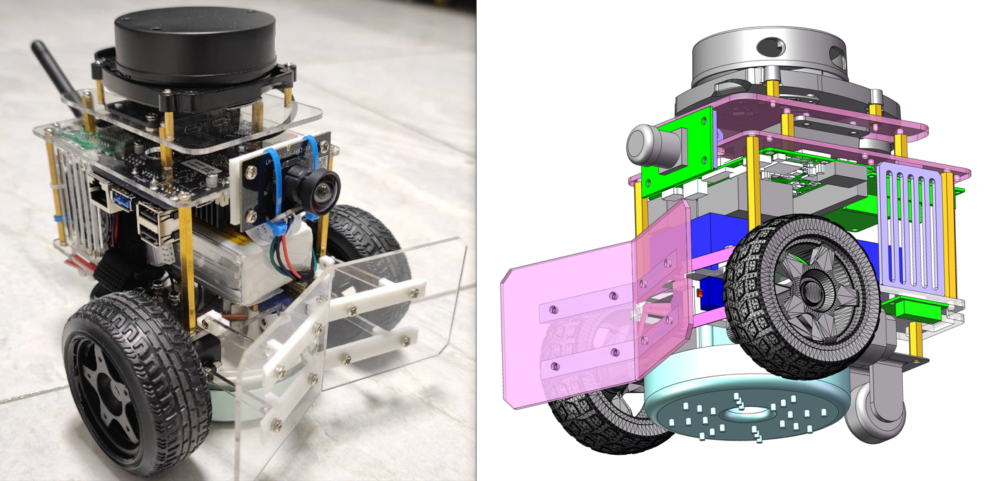 

小demo视频（**功能不局限于此**）： https://www.bilibili.com/video/BV1wG4y1h7TZ/?share_source=copy_web&vd_source=25cfc82384a4467c4092b69e7f853bfd  

## 对于可实现功能的建议：
### 按具体功能划分：

- **自主清理垃圾**——将桌面大的垃圾推到地面，小的垃圾（和尘土）收集进入垃圾储藏室
- **语音控制**、手机App控制、键盘控制、**手势控制**
- **人体跟踪**、猫狗跟踪、**语音交互**（到杯子那里去，到垃圾桶那里去，把杯子推回来，建图后打乱桌面物品让车子恢复原样，播报摄像头的检测到的内容，发现人站在车前播放：别当我路等等，功能取决于你的想象）

### 按涉及领域划分：

- **语音交互**：语音唤醒、语音开关机、语音控制车辆运动、语音调参、语音启停进程（开启关闭人体跟踪控制）、被识别物体语音播报
- **感知**：目标检测与分割、根据自车位置推测目标的平面位置和尺寸（结合cam和lidar）
- **定位建图**：slam建图和更新（包括正障碍-杯子， 结合tof建立负障碍-桌面边缘）
- **规划控制**：导航规划，路径规划，跟踪控制

## 硬件组成和成本清单：
**硬件结构图**：  
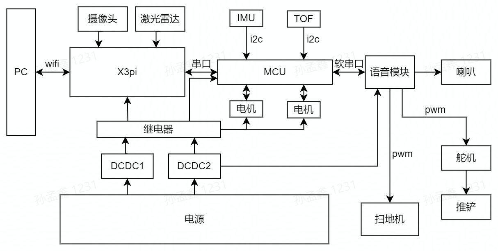  
### 说明：
- 摄像头识别，激光雷达slam建图
- IMU和轮速计（编码器）odom推算
- TOF是斜向下安装，用于**提前检测车辆是否到达桌面边缘**，如下图
- 继电器用于控制耗电量大的设备（语音模块可以长期待机）

|  TOF  |  扫地机    | 
| :--: | :--: |  
|   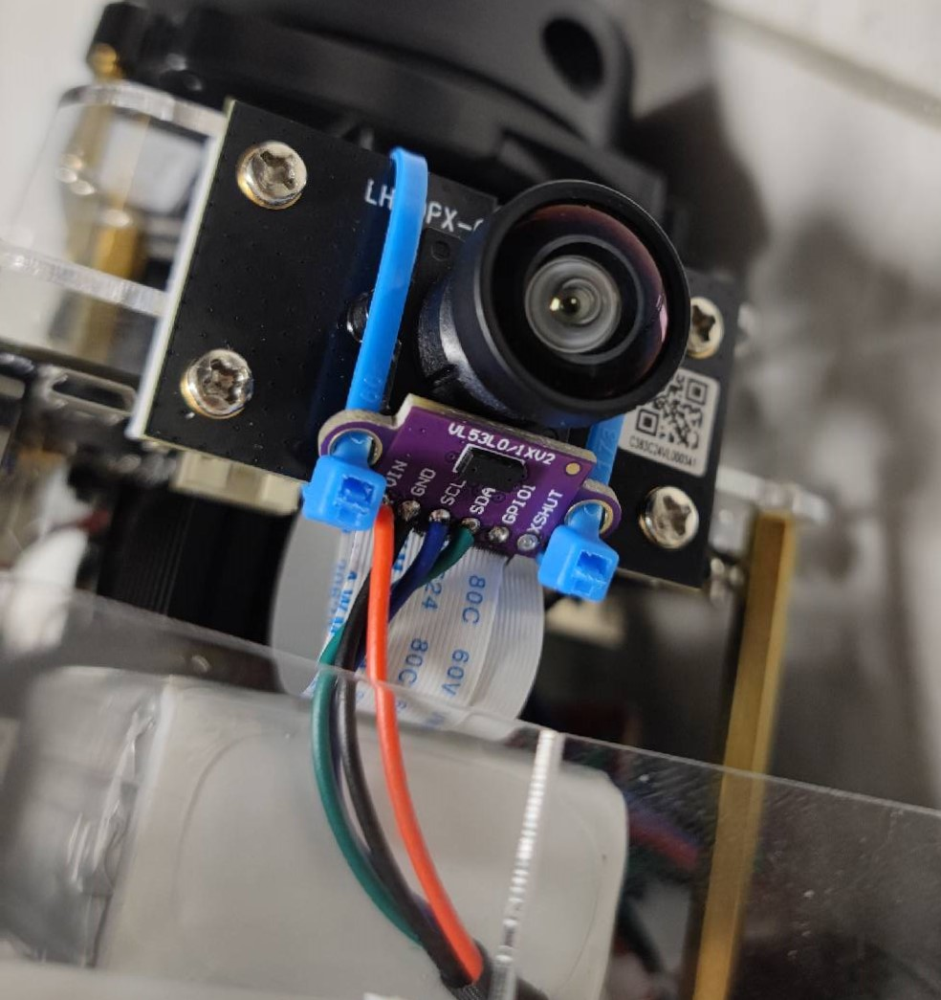   |  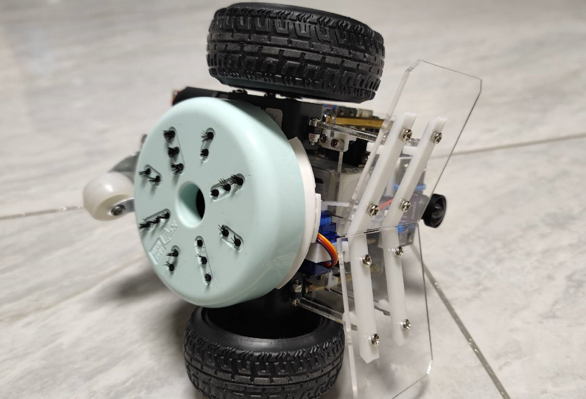    | 
|  |   |


|     名称     | 型号 | 数量 | 价格 |                          图片                                    |   链接   |
| :----------: | :--: | :--: | :--: | :----------------------------------------------------------: | :--: |
|    开发板    | X3派 |  1   |  549 | 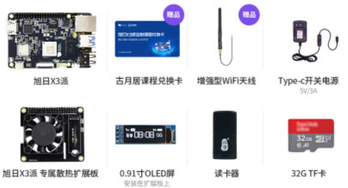 |   [tb](https://detail.tmall.com/item.htm?id=675925264685&spm=a1z09.2.0.0.4cf12e8dC3JTZy&_u=s1fg0d4t2a70&skuId=5036279679562)  |
|    摄像头    |   GC4663   |  1   |  129  | 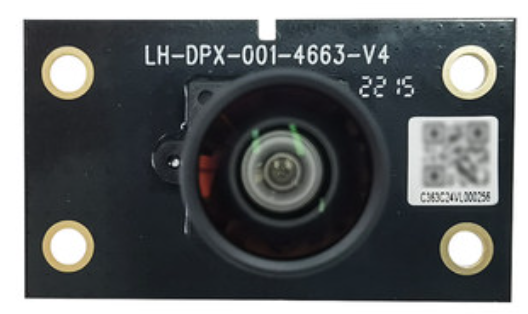 |  [tb](https://detail.tmall.com/item.htm?id=675925264685&spm=a1z09.2.0.0.4cf12e8dC3JTZy&_u=s1fg0d4t2a70&skuId=5036279679562)   |
|   激光雷达   |   YDLIDAR X3   |  1   |  299    | 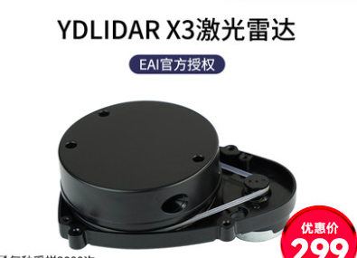 |   [tb](https://detail.tmall.com/item.htm?id=677279767739&spm=a1z09.2.0.0.4cf12e8dC3JTZy&_u=s1fg0d4teb410)   |
|     电机     |      |  2   |   35*2   | 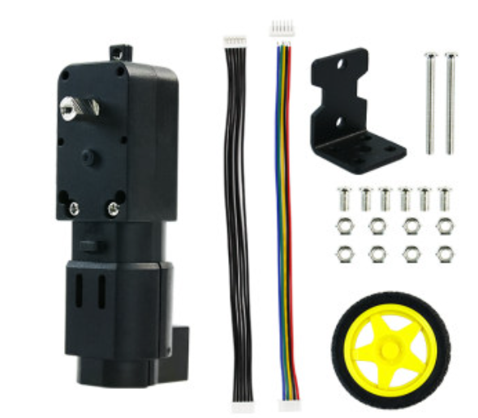 |   [tb](https://item.taobao.com/item.htm?spm=a1z09.2.0.0.4cf12e8dC3JTZy&id=654142226246&_u=s1fg0d4te9e4)   |
|     MCU      | Nano |  1   |  15    | 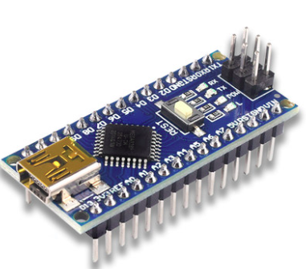 |   我红色的，网上好像没了   |
|   语音模块   |      |  1   |   64    | 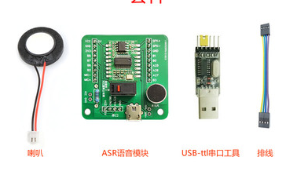 |  [tb](https://item.taobao.com/item.htm?spm=a1z09.2.0.0.4cf12e8dC3JTZy&id=648997376593&_u=s1fg0d4tc8fb)     |
|   电机驱动   |      |  2   |  3.7*2    | 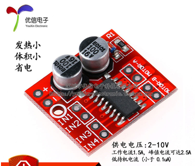 |   [tb](https://item.taobao.com/item.htm?spm=a1z09.2.0.0.4cf12e8dC3JTZy&id=530924739903&_u=s1fg0d4tfe7f)   |
|     IMU      |   MPU9250   |  1   |  42   | 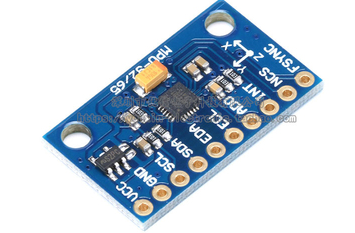 |   [tb](https://item.taobao.com/item.htm?spm=a1z09.2.0.0.4cf12e8dC3JTZy&id=536735464800&_u=s1fg0d4t36f2)   |
|     DCDC     |   3A   |  1   |   7.2*2   | 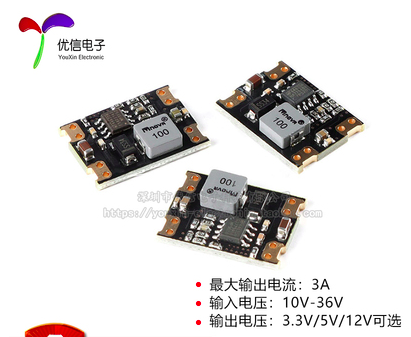 |  [tb](https://item.taobao.com/item.htm?spm=a1z09.2.0.0.4cf12e8dC3JTZy&id=644686235082&_u=s1fg0d4tf625)    |
|    继电器    |  5V    |  1   |   3.9   | 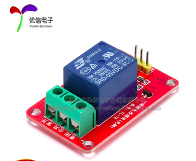 |   [tb](https://item.taobao.com/item.htm?spm=a1z09.2.0.0.4cf12e8dC3JTZy&id=546724904969&_u=s1fg0d4t5760)  |
|     舵机     |      |  2   |   12  | 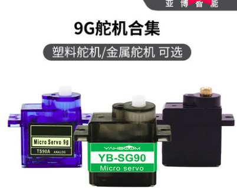 |  [tb](https://detail.tmall.com/item.htm?id=608897138062&spm=a1z09.2.0.0.4cf12e8dC3JTZy&_u=s1fg0d4t3282)   |
|   桌面清洁   |      |  1   |   58   | 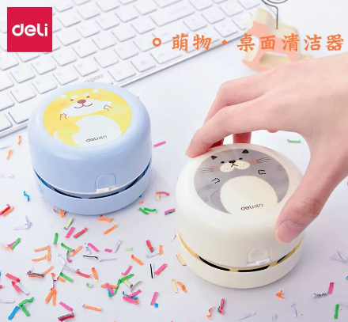 |   [tb](https://detail.tmall.com/item.htm?_u=s1fg0d4t8a33&id=666891204728&spm=a1z09.2.0.0.4cf12e8dC3JTZy)   |
| TOF | VL53L0X V2 | 1| 13.8|  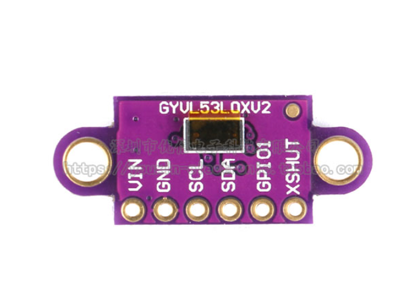 |  [tb](https://item.taobao.com/item.htm?spm=a1z09.2.0.0.4cf12e8dC3JTZy&id=561265041365&_u=s1fg0d4t719e) |
| 亚克力加工 |   |  1 |  19  |    |     [tb](https://detail.tmall.com/item.htm?_u=s1fg0d4t8040&id=637989965455&spm=a1z09.2.0.0.4cf12e8dC3JTZy)  |
| 3D打印  |   |   1  |   50  |    |  有点贵，自己找找把  |
| 杂七杂八 |  |   N   |   50  |   |    螺丝、舵机拉杆、扎带杜邦线、铜柱等                 |
|  总计   |   |       |   1398     |   |  e，成本好像也不低，前三个大头      |

## 软件组成：    

### Arduino：  
arduino用到了两个库，这连两个i2c总线设备共用一路i2c ：  
1. tof：https://github.com/pololu/vl53l0x-arduino
2. mpu9250(imu的校准程序在此库的历程里面，由于nano内存有限，需要校准imu的话需要先通过例程程序校准)：https://github.com/hideakitai/MPU9250    

端口定义：
```c
const uint8_t Motor1_PinA = 5;    
const uint8_t Motor1_PinB = 6;
const uint8_t Motor2_PinA = 9;
const uint8_t Motor2_PinB = 10;
const uint8_t Encoder1_PinA = 2;  //中断1
const uint8_t Encoder1_PinB = 4;
const uint8_t Encoder2_PinA = 3;  //中断2
const uint8_t Encoder2_PinB = 7;
SoftwareSerial mySerial(12, 13); // RX, TX
```
通讯协议：
主要协议参考：https://www.originbot.org/manual/protocol_description/ 

差异在于：
1. imu的数据发送 = 处理后的数据/100, 而不是原始数据
2. 传感器反馈里面没有电压值，有mcu的循环时间和转发语音板的语音指令
3. 控制器资源控制为从x3pi接收到的需要转发的语音板的指令信息

### 语音板子：
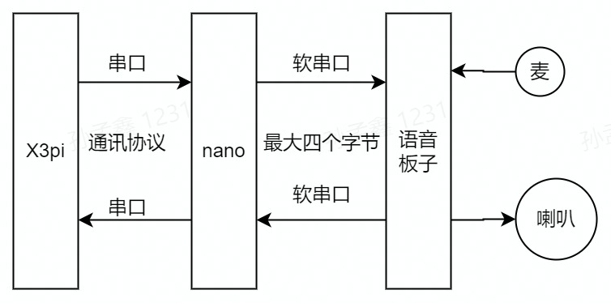  

**由于MCU和语音板子单词最多传输4个字节，且语音板子处理逻辑有限，因此mcu他们之间的传输只能依靠提前定义好的协议（比如 1  = 自建通过），且X3pi和语音板子的通信是通过MCU中转，因此也需要定义他们之前的协议，例如FCOS检测算法的80种类型分别对应80个整数，以此来实现被检测目标名称的语音播报**。

### X3pi：
有关上层相关的软件部分，地平线开发者社区和古月居已经给出了详细的参考文档：
1. 地平线开发者社区旭日X3pi的说明书：https://developer.horizon.ai/api/v1/fileData/documents_pi/Quick_Start/Quick_Start.html
2. 地平线开发者社区Togetheros的说明：https://developer.horizon.ai/api/v1/fileData/TogetherROS/index.html
3. 地平线开发者社区AI工具链：https://developer.horizon.ai/api/v1/fileData/doc/ddk_doc/navigation/ai_toolchain/docs_cn/horizon_ai_toolchain_user_guide/index.html
4. 古月居：https://www.originbot.org/

## 结尾
- 欢迎大家提出好的建议，在Issue里提问题，不定期查看
- 该文档会同步到地平线开发者社区，欢迎大家去查看，评论
- 该项目完全开源，欢迎大家魔改