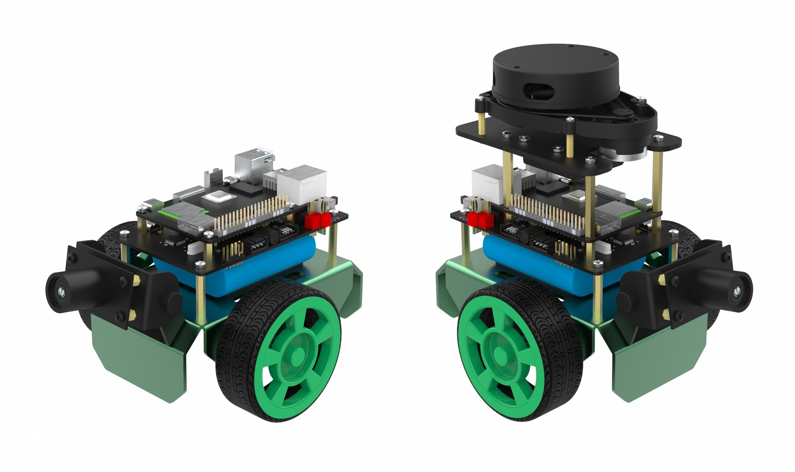

# OriginBot智能机器人开源套件

OriginBot是一款智能机器人开源套件，更是一个社区共建的开源项目，旨在让每一位参与者享受机器人开发的乐趣。

## 项目链接

### 项目主站

[https://www.originbot.org/](https://www.originbot.org/)

### 源码仓库

| 代码仓库                                                         | 说明                        |
| ------------------------------------------------------------ | --------------------------- |
[originbot ](https://gitee.com/guyuehome/originbot) | originbot机器人端功能包仓库 |
[originbot_desktop](https://gitee.com/guyuehome/originbot_desktop) | originbot电脑端功能包仓库   |
[originbot_controller](https://gitee.com/guyuehome/originbot_controller) | originbot控制器源码仓库     |

### 论坛交流

[https://guyuehome.com/Bubble/circleDetail/id/95](https://guyuehome.com/Bubble/circleDetail/id/95)

## 软件架构

- originbot_base：机器人底盘驱动
- originbot_driver：机器人设备驱动
    - serial_ros2：串口驱动包
    - ydlidar_ros2_driver：雷达驱动包
- originbot_msgs： OriginBot自定义通信接口
- originbot_bringup：机器人启动相关的脚本和文件
- originbot_demo：机器人基础功能的编程示例
- originbot_linefollower：机器人视觉巡线功能包
- originbot_navigation：机器人建图与导航相关的脚本和配置文件
- originbot_deeplearning：机器人深度学习功能
    - body_tracking：机器人人体跟随功能包
    - gesture_control：机器人手势控制功能包
    - line_follower_perception：机器人AI视觉巡线功能包

## 参与贡献

诚挚邀请各位开发者可以参与到OriginBot项目当中来，参与的方式和形式有很多种：

### **提供反馈**

- 在使用OriginBot套件的过程中，如有任何问题或者建议，欢迎在[古月居社区版块](https://guyuehome.com/Bubble/circleDetail/id/95)提问讨论；

- 在使用OriginBot软件的过程中，如有发现任何bug，欢迎在[代码仓库](https://gitee.com/guyuehome/originbot)中提交Issue；

  

### **贡献代码**

- 在使用OriginBot套件的过程中，如对原生代码有优化、增加等修改，欢迎在[代码仓库](https://gitee.com/guyuehome/originbot)中提交Pull Request；

  

### **开源传递**

- 如果你对OriginBot有兴趣，欢迎点赞该项目的源码仓库，或者分享给身边有需要的开发者；

- 如果基于OriginBot开源项目衍生出更多有意思的功能或者机器人，欢迎在[社区板块](https://guyuehome.com/Bubble/circleDetail/id/95)中与大家分享，优秀的项目我们也会在社区中宣传；

